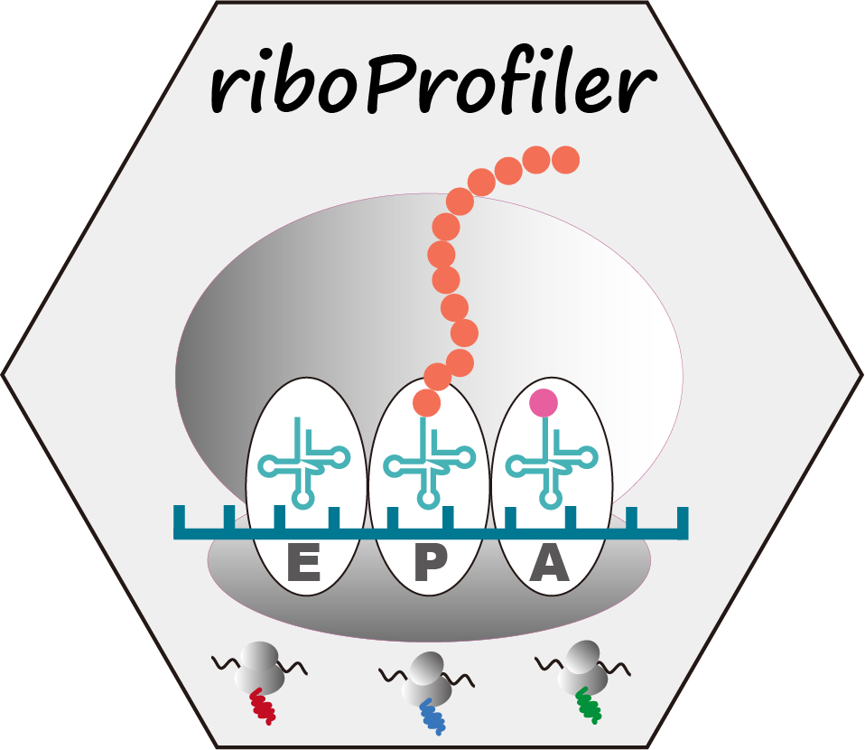

# RiboProfiler 

<!-- badges: start -->

A comprehensive package for analysis of ribosome profilling data. Integrating Ribo-SEQ upstream and downstream analysis process from raw fastq data into ribosome density data. Making Ribo-SEQ analysis
workflow more easier and concise for R users. Also supporting multiple kinds of visualization with Ribo quality checking and density tracks.

<!-- badges: end -->

## Requierment

> Please make sure you have installed **julia** and **python** first.

## Installation

You can install the development version of RiboProfiler like so:

``` r
# install.packages("devtools")
devtools::install_github("junjunlab/RiboProfiler")

# or
remotes::install_github("junjunlab/RiboProfiler")

library(RiboProfiler)
```

## Citation

> Jun Zhang (2023). *RiboProfiler: Integrating Ribo-SEQ Upstream and Downstream Analysis.*  https://github.com/junjunlab/RiboProfiler

## Documentation

> ***[https://junjunlab.github.io/RiboProfiler-manual/](https://junjunlab.github.io/RiboProfiler-manual/)***

