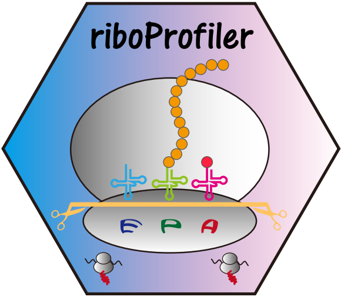

# RiboProfiler 

<!-- badges: start -->

Integrating Ribo-SEQ upstream and downstream analysis process from raw fastq data into ribosome density or count matrix data. Making Ribo-SEQ analysis
workflow more easier and concise for R users. Also supporting multiple kinds of visualization with Ribo quality checking and density tracks.

<!-- badges: end -->

## Installation

You can install the development version of RiboProfiler like so:

``` r
# install.packages("devtools")
devtools::install_github("junjunlab/RiboProfiler")
library(RiboProfiler)
```

## Citation

> Jun Zhang (2023). *RiboProfiler: Extract Sequence from Genome According to Annotation File.*  https://github.com/junjunlab/RiboProfiler

